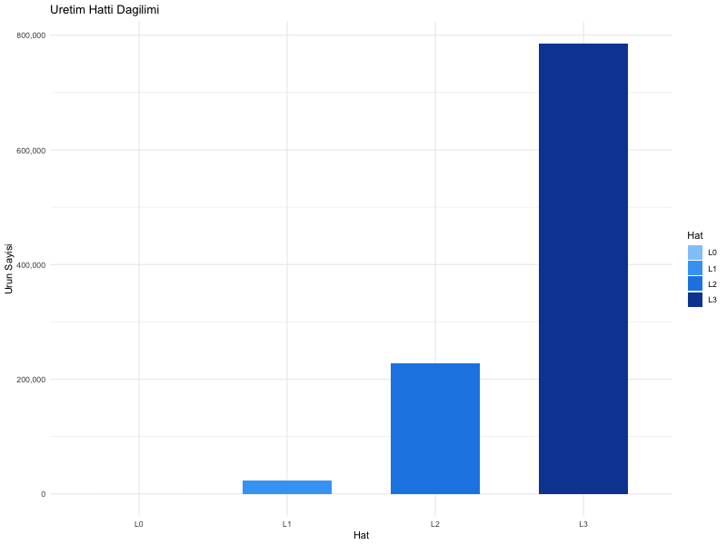
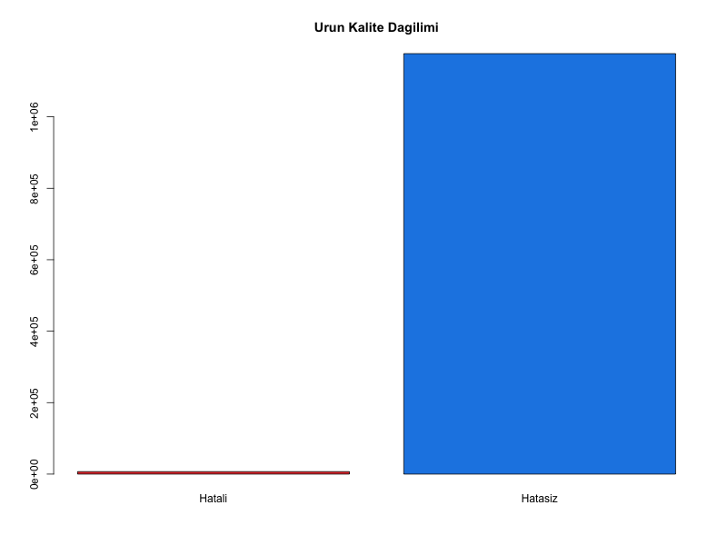
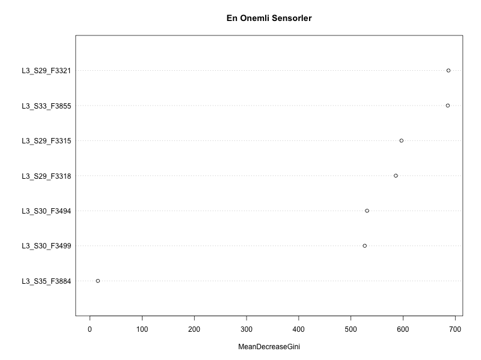

# Bosch Üretim Hattı Kalite Analizi

Bosch uretim hatti performans verisi üzerine yapılan kalite analizi projesi.

## Proje Özeti
- 1.18 milyon ürün, 969 sensör ölçümü analiz edildi
- DuckDB ile buyuk veri RAM doldurmadan islendi
- Random Forest modeli ile %97.4 doğruluk elde edildi
- Hatalı ürünlerin %100u başarıyla tespit edildi

## Kullanılan Teknolojiler
- R, RStudio
- DuckDB (buyuk veri isleme)
- Random Forest (makine ogrenmesi)
- ggplot2 (gorsellestirme)

## Ana Bulgular
- L3 hatti üretimin %66sini karşılıyor
- En kritik sensörler: L3_S29_F3321 ve L3_S33_F3855
- Ürün hata oranı: %0.58 (gercekçi endüstri verisi)
- Veri dengesizliği oversampling ile çözüldü

## Dosyalar
- `bosch_analiz.R` - Ana analiz kodu

## Veri Seti
Kaggle Bosch Production Line Performance
https://www.kaggle.com/competitions/bosch-production-line-performance
## Görseller

### Üretim Hattı Dağılımı

### Ürün Kalite Dağılımı

### En Önemli Sensörler

